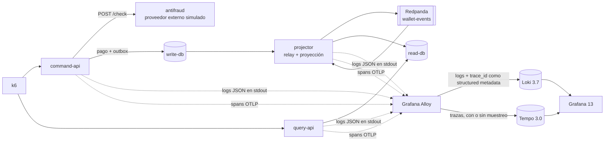

# loki-tempo-lab: Grafana Loki vs Tempo, logs y trazas medidos

Laboratorio de [idtt.](https://identity.pe/blog/grafana-loki-vs-tempo-logs-y-trazas?utm_source=github&utm_medium=referral&utm_campaign=grafana-loki-vs-tempo-logs-y-trazas&utm_content=readme) que instrumenta una billetera digital con OpenTelemetry, manda sus logs a **Grafana Loki** y sus trazas a **Grafana Tempo**, le inyecta incidentes y mide qué encuentra cada uno, cómo se enlazan con el `trace_id` y cuánto cuesta cada uno por request.

La billetera es la variante CQRS de [cqrs-lab](https://github.com/idtt-pe/cqrs-lab): un pago cruza una API, un antifraude externo, Postgres, un outbox, Kafka (Redpanda) y un proyector. Todo corre en una laptop con Docker y las cifras de `results/` salieron de este repositorio.

Estudio completo, paso a paso: **[Grafana Loki vs Tempo: ¿logs o trazas? Lo medimos](https://identity.pe/blog/grafana-loki-vs-tempo-logs-y-trazas?utm_source=github&utm_medium=referral&utm_campaign=grafana-loki-vs-tempo-logs-y-trazas&utm_content=readme)**.

## Arquitectura



| Pieza | Versión | Rol |
|---|---|---|
| `command-api`, `query-api` | NestJS 12 + Fastify | API de pagos y de consultas. Un log JSON por request (`pino`) con `trace_id`, `span_id`, ruta, estado, duración y billetera |
| `antifraud` | Node 22 | Proveedor externo simulado: no emite logs ni trazas propias. Las fallas se inyectan en caliente con `PUT /faults` |
| `projector` | kafkajs | Relay del outbox y proyección del modelo de lectura. Continúa la traza del pago a través de Kafka |
| Instrumentación | OpenTelemetry JS SDK 0.222 | http, undici, pg y pino, más spans manuales del antifraude, el relay y el proyector ([`packages/telemetry`](packages/telemetry)) |
| Grafana Alloy | 1.20.1 | Lee los logs de Docker y los manda a Loki; recibe OTLP y lo manda a Tempo. Reemplaza a Promtail, que llegó a su fin de vida el 2 de marzo de 2026 |
| Grafana Loki | 3.7.8 | Un solo binario, disco local, esquema v13 + TSDB |
| Grafana Tempo | 3.0.3 | Un solo binario (`-target=all`), disco local, sin Kafka |
| Grafana | 13.2.2 | Solo para explorar (`--profile ui`): Loki → Tempo con derived fields y Tempo → Loki con *trace to logs* |

Loki y Tempo corren con disco local para que el laboratorio entre en una laptop. Grafana recomienda object storage en producción y marca el backend local de Tempo como "for development and testing only".

## Qué mide

Una corrida dura 8 minutos con tráfico constante (100 pagos/s, 10 recargas/s, 200 estados de cuenta/s y 20 tableros/s) y dos incidentes inyectados:

| Minutos | Qué pasa | Pregunta |
|---|---|---|
| 0–2 | Normal | — |
| 2–4 | El antifraude responde 503 en el 3 % de los pagos | ¿Qué falló y a quién? |
| 4–6 | Los pagos de S/ 45 o más tardan 1.2 s más en el antifraude, sin ningún error | ¿Dónde se fue el tiempo? |
| 6–8 | Normal | — |

El 0,5 % del tráfico es de la billetera 777 (un cliente frecuente), para responder "¿qué le pasó a este cliente?".

La misma corrida se repite en cuatro modos:

| Modo | Trazas | Logs |
|---|---|---|
| `full` | 100 % | `trace_id` como structured metadata |
| `head10` | Head sampling al 10 % en el SDK (`parentbased_traceidratio`) | Igual |
| `tail` | Tail sampling en Alloy: errores, trazas de más de 500 ms y 10 % del resto | Igual |
| `label` | 100 % | `trace_id` como **label** de Loki (el error que la guía de Loki pide evitar) |

Por cada modo, `tools/measure.py` guarda en `results/raw/<modo>/report.json`:

- Bytes y líneas que recibió Loki, bytes y spans que recibió Tempo, streams de Loki y líneas descartadas.
- Disco: chunks + índice de Loki y bloques de Tempo, al final de la corrida.
- CPU y RAM de Loki, Tempo y Alloy (`docker stats` cada 5 s).
- Consultas LogQL y TraceQL cronometradas (mediana de 3), con los bytes que leyó cada backend.
- Cobertura: de los requests que Loki registró (errores, lentos, normales y cliente 777), cuántos tienen su traza en Tempo.

## Cómo correrlo

Requisitos: Docker con al menos 8 GB y 14 CPU asignados (los servicios se fijan a núcleos con `cpuset`), `curl` y Python 3.

```bash
git clone https://github.com/idtt-pe/loki-tempo-lab.git
cd loki-tempo-lab

docker compose up -d --wait write-db read-db redpanda
docker compose exec -T read-db psql -U lab -d wallet -q -f /rebuild/02-rebuild-from-write.sql
docker compose --profile projector --profile ui up -d --wait
```

Un pago y su rastro:

```bash
curl -s -XPOST localhost:3101/payments -H 'content-type: application/json' \
  -d '{"walletId":42,"merchantId":1,"amountCents":1250}'
docker compose logs --tail 2 command-api          # el log trae trace_id
```

Grafana queda en http://localhost:3000 (Explore → Loki o Tempo).

Inyectar fallas a mano:

```bash
curl -s -XPUT localhost:3103/faults -d '{"errorRate":0.03}'                       # 3 % de 503
curl -s -XPUT localhost:3103/faults -d '{"slowAboveCents":4500,"slowMs":1200}'     # lento, sin errores
curl -s -XPUT localhost:3103/faults -d '{}'                                        # todo normal
```

La batería completa (unos 45 minutos) y el resumen:

```bash
tools/bench.sh            # corre full, head10, tail y label, y escribe results/summary.md
tools/run.sh tail         # o un solo modo
```

Las salidas reales que aparecen como capturas en el estudio (consultas a Loki y Tempo, trazas dibujadas con `tools/traza.py`, el límite de streams y la cobertura con head sampling) las genera `tools/evidencia.sh` en `results/evidencia/`. Grafana queda en tema claro.

## Consultas útiles

```logql
{service_name="command-api", level="error"}
{service_name="command-api"} | json | route="/payments" | duration_ms > 1000
{service_name=~"command-api|query-api"} |= `"wallet_id":777,`
{service_name=~".+"} | trace_id="<trace_id>"
```

```traceql
{ status = error }
{ name = "POST /payments" && duration > 1s }
{ name = "antifraud.check" && duration > 1s }
{ span.wallet.id = 777 }
```

## Resultados

Cuatro corridas de 8 minutos, unos 158,000 requests cada una. Detalle completo en [`results/summary.md`](results/summary.md) y datos crudos en `results/raw/`.

| | Loki | Tempo (100 %) | Tempo (head 10 %) | Tempo (tail) |
|---|---|---|---|---|
| Bytes recibidos por request | 506 | 2,240 | 224 | 359 |
| Disco por request | 101 | 859 | 137 | 141 |
| RAM máxima durante la carga | 138 MiB | 708 MiB | 266 MiB | 246 MiB |
| Pagos con error que tienen su traza | — | 100 % | 10 % | 100 % |
| Pagos lentos que tienen su traza | — | 100 % | 9 % | 100 % |

- **Pago que falla (331 casos):** Loki lo encuentra por etiqueta en 5.8 ms y la línea trae el motivo. Tempo también, con `{ status = error }`.
- **Pago lento sin errores (1,330 casos):** Loki encuentra los requests lentos porque el log guarda la duración, pero no dice dónde se fue el tiempo. En 100 trazas lentas, `antifraud.check` ocupó el 99.9 % del pago (mediana) y las consultas SQL, 1.1 ms ([`results/evidencia/lentos-desglose.txt`](results/evidencia/lentos-desglose.txt)).
- **Cliente frecuente (billetera 777):** Loki encuentra todos sus requests, pero lee 76 MB (todos los logs de la ventana). Con head sampling al 10 %, Tempo tiene solo el 9 % de sus trazas.
- **`trace_id` como label:** la búsqueda por `trace_id` baja de 171 ms a 2 ms, pero Loki llegó a su límite de 5,000 streams a los 44 segundos y rechazó los logs nuevos. Quedaron unas 18,000 líneas de ~258,000 y ningún log de error.

### Advertencias

- Un solo nodo, disco local y una laptop: sirve para comparar Loki con Tempo entre sí, no como cifra de capacidad de producción.
- Con los límites por defecto de Loki (4 MB/s de ingesta y 4 MB por mensaje gRPC), la ráfaga inicial de logs y las consultas de 5,000 líneas fallaron. Los subimos en [`loki/loki.yaml`](loki/loki.yaml).
- Los conteos con TraceQL metrics (`count_over_time`) no coincidieron con la búsqueda en los modos con muestreo, así que el estudio usa la cobertura medida traza por traza.
- La instrumentación de NestJS de OpenTelemetry no se enganchó con módulos ESM; los spans salen de http, undici, pg y de spans manuales.

## Licencia

MIT. Hecho por [idtt.](https://identity.pe?utm_source=github&utm_medium=referral&utm_campaign=grafana-loki-vs-tempo-logs-y-trazas&utm_content=readme)
